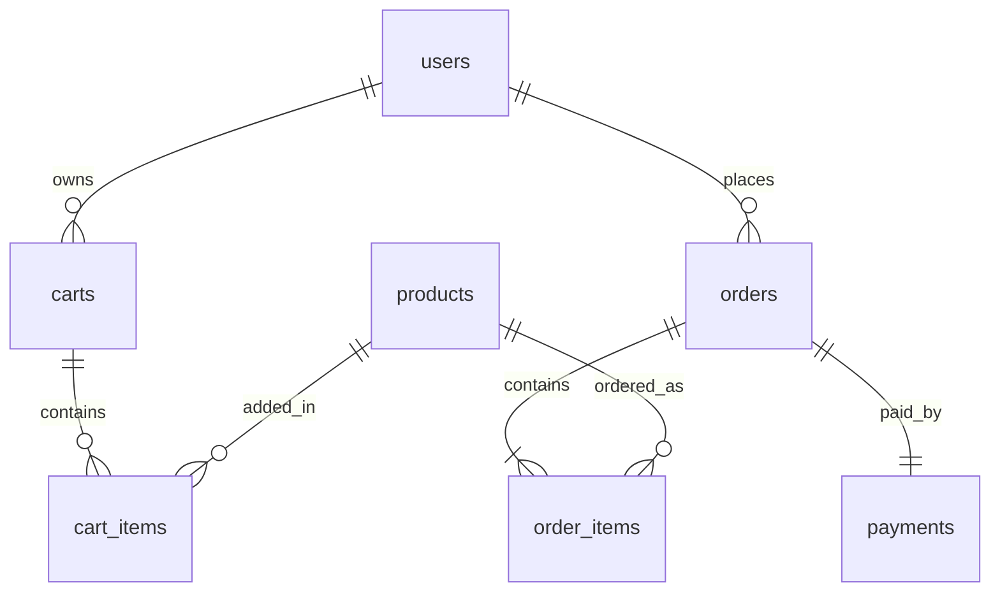

# The Smart-Niche Marketplace (Eco Clean) - Web Tech Minigroup Assignment

ยินดีต้อนรับสู่โปรเจกต์ระบบร้านค้าออนไลน์ขายผักและผลไม้ **The Smart-Niche Marketplace** ที่ถูกพัฒนาขึ้นจากเทมเพลตเว็บไซต์ **Fruitables** โดยได้ทำการเชื่อมต่อหน้าเว็บเพจฝั่งสถาปัตยกรรมส่วนหน้า (Frontend) เข้ากับระบบบริการจัดการข้อมูลหลังบ้าน (Backend API) เพื่อให้ระบบมีการทำงานแบบ Full-stack และมีความปลอดภัยตามมาตรฐานสากล

---

## 1. ภาพรวมโปรเจกต์ (Project Overview)

โปรเจกต์นี้เป็นการเปลี่ยนโฉมเว็บไซต์เทมเพลต HTML/CSS/JS แบบ Static (เดิมใช้การประมวลผลข้อมูลจำลองบนเบราว์เซอร์ผ่าน `localStorage`) ให้ทำงานร่วมกับเว็บเซิร์ฟเวอร์หลังบ้านที่มีระบบฐานข้อมูล SQL คอยทำหน้าที่เป็น **"แหล่งข้อมูลที่ถูกต้องเพียงหนึ่งเดียว" (Source of Truth)**

### โครงสร้างการทำงานหลัก
- **Frontend**: แสดงผลหน้าจอขายสินค้า, หน้ากรองข้อมูล, หน้าตะกร้าสินค้า, หน้าการเข้าสู่ระบบ/สมัครสมาชิก และหน้าสั่งซื้อสินค้าผ่านเบราว์เซอร์ของผู้ใช้
- **Backend API**: บริการเว็บ API สำหรับจัดการบัญชีผู้ใช้งาน, ดึงรายการสินค้าพร้อมตัวกรอง, บันทึกสถานะตะกร้าสินค้า, ตรวจสอบสินค้าในสต็อก, คำนวณราคาส่วนลดต่างๆ ตลอดจนบันทึกยอดการชำระเงินและคำสั่งซื้อลงฐานข้อมูลอย่างปลอดภัย

---

## 2. โครงสร้างโปรเจกต์ (Project Structure)

โปรเจกต์นี้แบ่งแยกส่วนการทำงาน (Separation of Concerns) ออกเป็นสองส่วนอย่างชัดเจน:

### 📁 ส่วนจัดแสดงผลลัพธ์ (Frontend - Root Directory)
ประกอบไปด้วยหน้า HTML และสคริปต์หลักที่เชื่อมโยงกันดังนี้:
* `index.html` - หน้าแรกของระบบ นำเสนอสินค้าแนะนำและโปรโมชัน
* `shop.html` - หน้าร้านค้าสำหรับเลือกสรรและค้นหาสินค้า
* `cart.html` - หน้าจัดการสินค้าในตะกร้าคำนวณราคารายการ
* `checkout.html` - หน้าสรุปคำสั่งซื้อและกรอกข้อมูลจัดส่งสินค้า
* `login.html` & `register.html` - หน้าลงชื่อเข้าใช้และลงทะเบียนสมาชิก
* `js/apiClient.js` - ไฟล์หลักที่เป็นตัวกลางเรียกใช้บริการ HTTP Request ไปยัง API หลังบ้าน รวมถึงการจัดการ token ความปลอดภัยและ guest session ใน `localStorage`

### 📁 ส่วนบริการข้อมูลระบบหลังบ้าน (Backend - `/backend` Directory)
พัฒนาด้วยโครงสร้างสถาปัตยกรรมแบบ **Controller-Route-Service-Database** ดังนี้:
* `/backend/src/routes/` - กำหนดเส้นทาง URL (Endpoints) ของ API ในการเชื่อมต่อ
* `/backend/src/controllers/` - รับ-ส่งข้อมูล (Request/Response) และตรวจสอบความถูกต้องของข้อมูลเบื้องต้น
* `/backend/src/services/` - จัดการตรรกะทางธุรกิจหลัก (Business Logic) เช่น ระบบตรวจสอบสต็อกสินค้าและระบบการคำนวณส่วนลด
* `/backend/src/database/` - กำหนดค่าคอนฟิกรูปร่างฐานข้อมูล SQLite
* `/backend/database/migrations/` - เก็บไฟล์สคริปต์ SQL สำหรับสร้างโครงสร้างตารางฐานข้อมูลและอัปเดตระบบ
* `/backend/mock-data/` - เก็บข้อมูลจำลองตั้งต้น

---

## 3. ฟีเจอร์หลัก (Key Features)

ระบบได้รับการพัฒนาฟีเจอร์สำคัญด้านธุรกิจอีคอมเมิร์ซแบบครบวงจร:

1. **ระบบบริหารจัดการตะกร้าสินค้าแบบคู่ขนาน (Hybrid Cart Persistence)**:
   - **Guest Cart**: ลูกค้าทั่วไปสามารถหยิบสินค้าใส่ตะกร้าได้ โดยข้อมูลจะบันทึกลงสู่ Database ฝั่งหลังบ้านผ่านการใช้ `X-Cart-Session-Id`
   - **Member Cart**: เมื่อผู้ใช้เข้าสู่ระบบ รายการสินค้าในตะกร้าจะย้ายไปผูกกับบัญชีสมาชิกคนนั้นโดยอัตโนมัติ และซิงก์ข้อมูลผ่าน JWT token
2. **ระบบส่วนลดสมาชิกลดราคาส่งเสริมการขาย (Eco-Refill Subscription Discount)**:
   - มอบส่วนลดพิเศษ **20%** สำหรับรายการสินค้าที่เป็นประเภทสั่งซื้อแบบสม่ำเสมอ (Recurring) เฉพาะลูกค้าที่ลงชื่อเข้าใช้ระบบ (Logged-in Member) เท่านั้น
3. **ระบบป้องกันข้อมูลและราคาผิดพลาด (Gatekeeper Security)**:
   - เซิร์ฟเวอร์ทำหน้าที่คำนวณราคาสินค้า, ยอดรวม, ส่วนลด และจำนวนสินค้าทั้งหมดด้วยตัวเอง โดยอิงราคาจากฐานข้อมูลเท่านั้น และจะ**ปฏิเสธ**รายการสั่งซื้อที่ส่งผลลัพธ์คำนวณมาจากหน้าบ้านทันทีด้วยโค้ด `CLIENT_CALCULATION_REJECTED` เพื่อป้องกันการโกงราคา
4. **ระบบคำนวณส่วนลดปลายบิลอัจฉริยะ (Dynamic Discount Service)**:
   - บริการหลังบ้านจะคำนวณหาโปรโมชันที่คุ้มค่าที่สุดให้ผู้ใช้โดยอัตโนมัติ:
     - ส่วนลด **10%** เมื่อยอดการสั่งซื้อสะสมรวมมากกว่า `$200`
     - ส่วนลด **15%** เมื่อมีสินค้าจากหมวดหมู่ "Fresh" มากกว่า 3 รายการขึ้นไปในตะกร้า

---

## 4. เทคโนโลยีที่ใช้ (Tech Stack)

### สถาปัตยกรรมระบบหน้าบ้าน (Frontend)
- **HTML5 & CSS3 / SCSS**: ออกแบบและตกแต่งหน้าจอ
- **Bootstrap 5**: เฟรมเวิร์กจัดการ Layout และ UI Components จากเทมเพลต Fruitables
- **Vanilla JavaScript (ES6)**: พัฒนาตัวควบคุมการทำงานและจัดการ Event, การเรียกใช้ API ผ่าน Fetch API

### สถาปัตยกรรมระบบหลังบ้าน (Backend)
- **Node.js & Express.js**: ระบบเว็บเซิร์ฟเวอร์รันระบบ RESTful API
- **SQLite 3**: ระบบจัดการฐานข้อมูลเชิงสัมพันธ์แบบฝังตัว (Embedded Relational Database)
- **bcryptjs**: ไลบรารีสำหรับแฮชรหัสผ่านผู้ใช้งานก่อนบันทึกลงสู่ฐานข้อมูล
- **jsonwebtoken (JWT)**: ออกรหัสผ่านดิจิทัลสำหรับยืนยันตัวตนสมาชิกแบบไร้สถานะ (Stateless Authentication)
- **Helmet**: เสริมความปลอดภัยของเซิร์ฟเวอร์ด้วยการกำหนดค่า HTTP Response Headers

---

## 5. วิธีการติดตั้งและเริ่มใช้งาน (Installation and Setup)

กรุณาตรวจสอบว่ามีโปรแกรม **Node.js** ติดตั้งอยู่บนเครื่องของคุณเรียบร้อยแล้ว

### 🚀 การเริ่มรันระบบหลังบ้าน (Backend API)

1. เปิด Terminal แล้วไปที่โฟลเดอร์ backend:
   ```bash
   cd backend
   ```
2. สร้างไฟล์กำหนดค่าสภาพแวดล้อมจากไฟล์ตัวอย่าง:
   ```bash
   cp .env.example .env
   ```
   *(สามารถเข้าไปแก้ไขคีย์ความลับ `JWT_SECRET` และพอร์ตทำงาน `PORT` ในไฟล์ `.env` ได้)*
3. ติดตั้งโปรแกรมที่เกี่ยวข้องทั้งหมด:
   ```bash
   npm install
   ```
4. ติดตั้งโครงสร้างฐานข้อมูล (Database Migrations):
   ```bash
   npm run db:migrate
   ```
5. บันทึกข้อมูลสินค้าและบัญชีทดสอบเริ่มต้น (Seeding Database):
   ```bash
   npm run db:seed
   ```
   *(หมายเหตุ: ข้อมูลบัญชีผู้ใช้เริ่มต้นสำหรับทดลองใช้งานจะใช้รหัสผ่านว่า `password` เสมอ)*
6. รันตรวจสอบความถูกต้องของระบบและตรวจสอบความพร้อมก่อนขึ้นระบบ (Deployment Audit):
   ```bash
   npm run audit:deploy
   ```
7. เริ่มต้นเปิดรันเซิร์ฟเวอร์ในโหมดพัฒนา (Development Mode):
   ```bash
   npm run dev
   ```
   *ระบบหลังบ้านจะเริ่มต้นรันที่พอร์ต `http://localhost:3001` โดยมีหน้า API อยู่ที่ปลายทาง `/api`*

### 💻 การเปิดใช้งานหน้าบ้าน (Frontend UI)
- คุณสามารถเปิดใช้งานหน้าเว็บได้ง่ายๆ ด้วยการเปิดไฟล์ `index.html` บนเว็บเบราว์เซอร์ของคุณโดยตรง หรือเปิดผ่านเครื่องมืออำนวยความสะดวกอย่างปลั๊กอิน **Live Server** ใน Visual Studio Code (ที่อยู่เริ่มต้น `http://127.0.0.1:5500/index.html`)

---

## 6. การรักษาความปลอดภัยและฐานข้อมูล (Security and Database Design)

### โครงสร้างการจัดเก็บข้อมูล (Database Relational Schema)
ตารางความสัมพันธ์ถูกออกแบบโดยคำนึงถึงความครบถ้วนสมบูรณ์ของความสัมพันธ์ (Relational Integrity) ด้วยเงื่อนไขการอ้างอิงรหัสต่างตาราง (Foreign Keys Constraint) ประกอบด้วย:
* `users` - บันทึกโปรไฟล์ผู้ใช้ และ Hash รหัสผ่าน (ไม่มีการจัดเก็บรหัสผ่านจริง)
* `products` - จัดการข้อมูลชื่อ, หมวดหมู่, สต็อก และราคาสินค้าหลัก
* `carts` & `cart_items` - บันทึกสถานะสินค้าในตะกร้าแยกตามบัญชีหรือ session ID
* `orders` & `order_items` - บันทึกคำสั่งซื้อรวมถึงราคาและยอดส่วนลดขณะสั่งซื้อ
* `payments` - บันทึกประวัติสถานะการชำระเงินของแต่ละคำสั่งซื้อ



### การตั้งค่าความปลอดภัยที่สำคัญ
- **ความปลอดภัยฐานข้อมูล**: มีสคริปต์ตรวจความถูกต้อง `npm run db:audit` เพื่อยืนยันว่าตารางและคุณสมบัติ Relational Integrity ครบถ้วนตามมาตรฐานการออกแบบ
- **การป้อนข้อมูลที่ปลอดภัย**: ตรรกะการรันคำสั่ง SQL ของระบบหลังบ้านจะส่งค่าตัวแปรผ่าน Parameterized Queries (การใส่เครื่องหมาย `?` เพื่อระบุตำแหน่งตัวแปรในคิวรี) ทุกกรณี ซึ่งสามารถป้องกันการโจมตีประเภท SQL Injection ได้อย่างเด็ดขาด
- **ความสมบูรณ์ของธุรกรรมข้อมูล**: ฟังก์ชันสั่งซื้อและอัปเดตสต็อกดำเนินการภายใต้ `withTransaction` ซึ่งเป็นตัวช่วยเขียนข้อมูลแบบปรมาณู (Atomic Writes) ในฝั่งเซิร์ฟเวอร์ หากออร์เดอร์ล้มเหลว สต็อกสินค้าจะไม่มีการเปลี่ยนแปลงและจะถูกกู้คืนทั้งหมดเพื่อป้องกันข้อมูลขัดแย้งกัน
